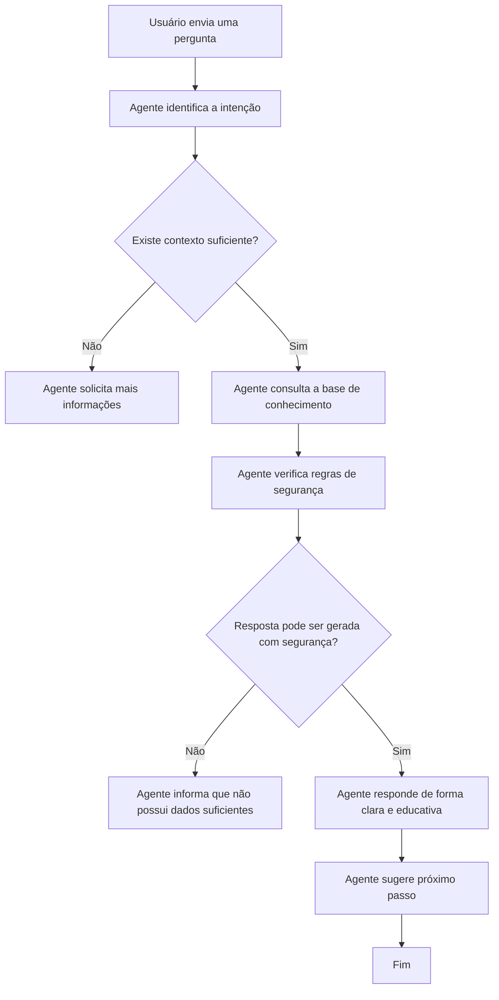

# Arquitetura do FinGuard funcionamento conceitual do agente FinGuard IA.

## Explicação do fluxo

1. A pessoa usuária envia uma pergunta ao agente.
2. O agente identifica a intenção da pergunta.
3. O agente verifica se possui contexto suficiente para responder.
4. Caso falte informação, ele solicita mais detalhes.
5. Caso tenha informação suficiente, consulta a base de conhecimento.
6. Antes de responder, valida as regras de segurança e anti-alucinação.
7. Se a resposta puder ser gerada com segurança, apresenta uma resposta clara e educativa.
8. Ao final, sugere um próximo passo prático.
